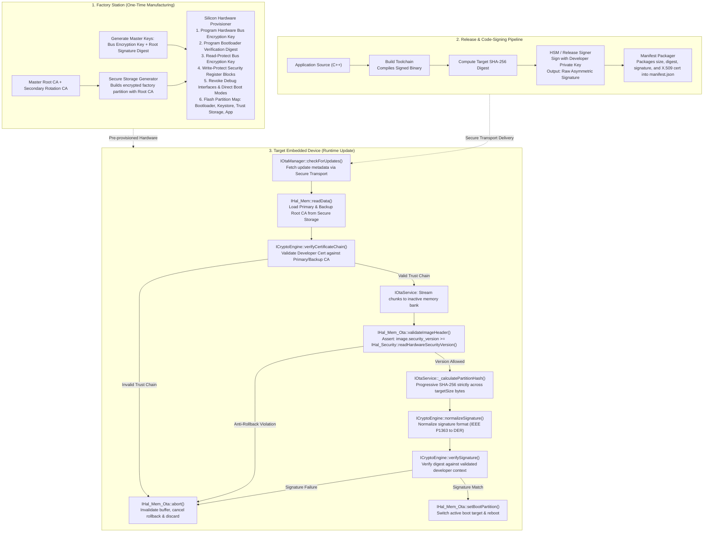
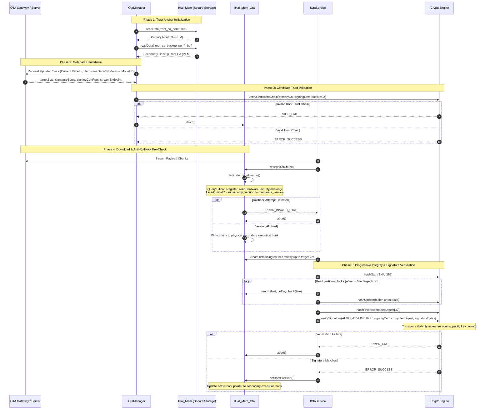

### Core Architecture Pillars (Platform-Agnostic Abstraction)

| Security Layer | Hardware / Silicon Anchor | Generic Interface / Firmware Abstraction | Security Guarantee |
| :--- | :--- | :--- | :--- |
| **Boot Integrity** | Silicon Root of Trust (OTP / eFuse Signature Digest) | `IBootloader` $\rightarrow$ Secure Boot Anchor Stage | Executes only binaries signed with the authorized developer public key. |
| **Data Confidentiality** | Hardware Bus Cryptographic Engine (AES-XTS) | `IHal_FlashEncryption` (Transparent inline bus encryption) | Physical SPI/bus dumps expose only ciphertext. |
| **Silicon Lockdown** | Permanent Hardware Control Registers / Lock Bits | Physical OTP Write/Read Protection Registers | Hardware debug interfaces (JTAG/SWD) and unvalidated execution paths are permanently revoked. |
| **Anti-Rollback** | Monotonic Hardware Security Counter / eFuse | `IHal_Mem_Ota::validateImageHeader()` $\rightarrow$ `IHal_Security::readHardwareSecurityVersion()` | Rejects firmware images carrying a security counter lower than the hardware threshold. |
| **Trust Anchors** | Hardware-Encrypted Key Partition | `IHal_Mem::readData()` $\rightarrow$ `IOtaManager` (Secure Partition Scope) | Root certificates reside in authenticated, encrypted storage; zero credentials in `.rodata`. |
| **Payload Integrity** | Asymmetric Cryptographic Algorithm (ECDSA / RSA) | `IOtaService` $\rightarrow$ `ICryptoEngine::verifySignature()` | Hash calculation is strictly bounded to `targetSize`; verified against validated X.509 chain. |

---

### System Architecture & Provisioning Flow

---

### Cryptographic Verification & Memory Layout

