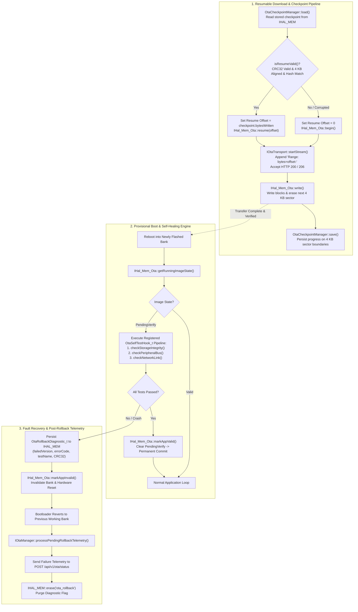

### Core Architecture Pillars (Platform-Agnostic Abstraction)

| Reliability Layer | Hardware / Subsystem Anchor | Generic Interface / Firmware Abstraction | Resiliency Guarantee |
| :--- | :--- | :--- | :--- |
| **Provisional Boot Trial** | Hardware Dual-Bank Selector / Boot Slot Tracker | `IHal_Mem_Ota::getRunningImageState()` | Newly flashed firmware executes in provisional trial mode (`PendingVerify`); unhandled panics cause the bootloader to revert to the previous bank [7, 8]. |
| **Self-Healing Diagnostics** | Non-Volatile Storage & Attached Bus Peripherals | `IOtaManager::registerSelfTest()` $\rightarrow$ `validateCurrentFirmware()` | Commits active bank as permanently valid via `markAppValid()` only after all storage, bus, and network diagnostic checks pass. |
| **Resumable Transport** | Flash Sector Alignment Boundary (4 KB / `0x1000`) | `IOtaTransport::setResumeOffset()` $\rightarrow$ `IHttpClient` (`Range: bytes=X-` / HTTP `206`) | Network dropouts resume from the last completed 4 KB sector; eliminates re-downloading previously verified bytes [8, 10]. |
| **State Persistence** | Non-Volatile Checkpoint Partition | `OtaCheckpointManager` $\rightarrow$ `IHAL_MEM` + `Crc32::calculate()` | Checkpoint tracks written byte offsets and target hashes with CRC-32 integrity; corrupt checkpoints are purged automatically. |
| **Starvation & Watchdog Defense** | Hardware Task Watchdog Timer (WDT) / RTOS Scheduler | `IHal_Sys_Wdt::feed()`, `IHal_Sys_Wdt::yield()` $\rightarrow$ `IOtaService` | Prevents watchdog resets and task starvation during long-running progressive hashing (3.5 MB) and continuous stream writes. |
| **Rollback Diagnostics** | Non-Volatile Crash Logging Block | `OtaRollbackDiagnostic_t` $\rightarrow$ `IOtaManager::processPendingRollbackTelemetry()` | Records failure codes in persistent storage before calling `markAppInvalid()`; dispatches diagnostic report to gateway upon fallback boot. |

---

### System Architecture & Runtime Flow

---

### Resumption, Watchdog & Self-Healing Sequence

```mermaid
sequenceDiagram
    autonumber
    participant Srv as OTA Gateway / Server
    participant Mgr as IOtaManager
    participant Cp as OtaCheckpointManager
    participant Mem as IHAL_MEM (Storage)
    participant Hal as IHal_Mem_Ota
    participant Svc as IOtaService
    participant Wdt as IHal_Sys_Wdt

    Note over Mgr,Cp: Phase 1: Download Resumption Check
    Mgr->>Cp: load(checkpoint)
    Cp->>Mem: readData("ota_chkpt")
    Mem-->>Cp: Raw Checkpoint Bytes
    alt Valid CRC32 & 4 KB Sector Aligned
        Cp-->>Mgr: Resume from offset (e.g. 65536)
        Mgr->>Svc: startUpdate(startOffset = 65536)
        Svc->>Hal: resume(targetSize, 65536)
    else Missing / Corrupt Checkpoint
        Cp-->>Mgr: No checkpoint
        Mgr->>Svc: startUpdate(startOffset = 0)
        Svc->>Hal: begin(targetSize)
    end

    Note over Svc,Srv: Phase 2: Stream Download with Range Header
    Svc->>Srv: GET /firmware.bin (Range: bytes=65536-)
    Srv-->>Svc: HTTP 206 Partial Content (Streaming Remaining Chunks)
    loop Stream Processing & Checkpoint Persistence
        Svc->>Hal: write(chunk)
        Svc->>Wdt: feed()
        opt Every 4 KB Sector Boundary
            Svc->>Cp: save(bytesWritten, targetHash, CRC32)
            Cp->>Mem: writeData("ota_chkpt", payload)
        end
    end
    Svc->>Cp: clear()
    Cp->>Mem: erase("ota_chkpt")

    Note over Svc,Wdt: Phase 3: Starvation Defense during Verification
    Svc->>Svc: _calculatePartitionHash(targetSize)
    loop Progressive Hash Traversal
        Svc->>Hal: read(offset, 4096)
        Svc->>Wdt: feed()
        Svc->>Wdt: yield(1)
    end

    Note over Mgr,Hal: Phase 4: Provisional Boot & Self-Healing Validation
    Svc->>Hal: setBootPartition()
    Mgr->>Mgr: rebootSystem()
    Note over Hal: Hardware reboots into newly flashed bank in state: PendingVerify
    Mgr->>Hal: getRunningImageState()
    Hal-->>Mgr: OtaImageState::PendingVerify

    rect rgb(20, 35, 20)
        Note over Mgr: Scenario A: Diagnostic Tests Pass
        Mgr->>Mgr: Run Self-Test Hooks (Storage, Peripherals, Network)
        Mgr->>Hal: markAppValid()
        Note over Hal: Cancel rollback & mark partition permanently valid
    end

    rect rgb(35, 20, 20)
        Note over Mgr,Mem: Scenario B: Diagnostic Test Fails
        Mgr->>Mgr: Self-Test Fails (e.g. Storage / Network failure)
        Mgr->>Mem: writeData("ota_rollback", OtaRollbackDiagnostic_t)
        Mgr->>Hal: markAppInvalid()
        Note over Hal: Reboots hardware immediately back into original working bank
        Note over Mgr: Fallback Bank Boots -> processPendingRollbackTelemetry()
        Mgr->>Mem: readData("ota_rollback")
        Mgr->>Srv: POST /api/v1/ota/status (status: "failure", failed_version)
        Srv-->>Mgr: HTTP 200 OK
        Mgr->>Mem: erase("ota_rollback")
    end
```

