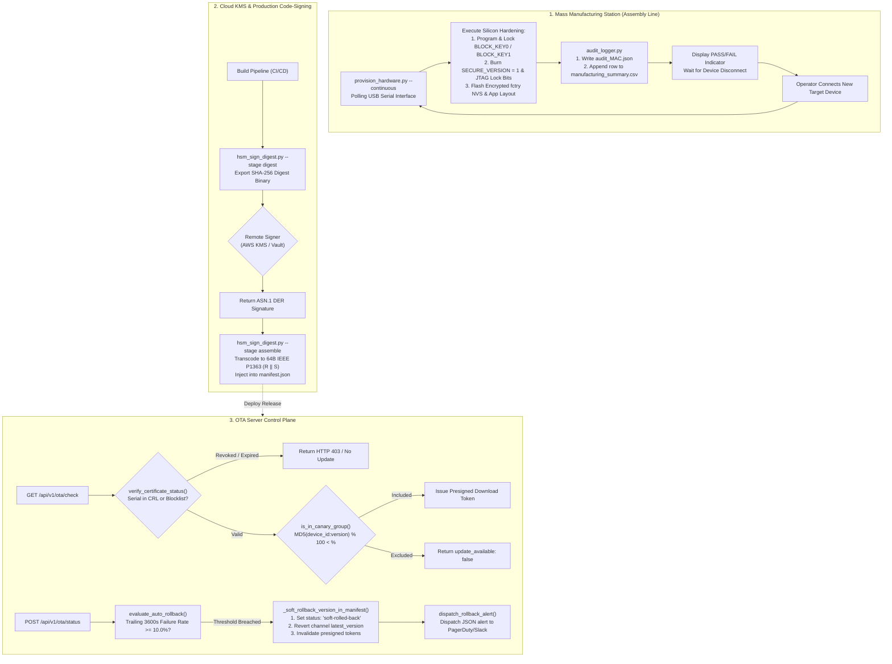
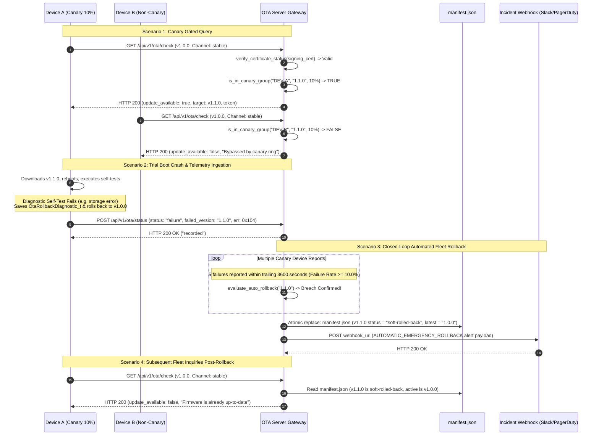

### Core Architecture Pillars (Platform-Agnostic Abstraction)

| Operational Layer | Cloud / Manufacturing Infrastructure | Generic Interface / Platform Abstraction | Operational Guarantee |
| :--- | :--- | :--- | :--- |
| **Air-Gapped / Cloud KMS Signing** | Remote Hardware Security Module (AWS KMS / HashiCorp Vault / PKCS#11) | `hsm_sign_digest.py` (`--stage digest` $\rightarrow$ KMS $\rightarrow$ `--stage assemble`) | Developer private keys never touch developer workstations or CI runners; raw 64-byte IEEE P1363 signatures generated remotely [19]. |
| **Trust Revocation & Gating** | Certificate Revocation List (CRL) & Serial Blocklist | `verify_certificate_status()` $\rightarrow$ `GET /api/v1/ota/check` | Revoked or expired developer signing certificates are immediately barred from distributing updates across the fleet. |
| **Stateless Canary Cohorts** | Deterministic Modulo Partitioning | `is_in_canary_group(device_id, version, percentage)` | Staggered deployment rings (1% $\rightarrow$ 5% $\rightarrow$ 25% $\rightarrow$ 100%) distribute firmware deterministically without maintaining database state per device. |
| **Closed-Loop Fleet Protection** | Trailing Sliding-Window Telemetry Evaluator (3600s) | `evaluate_auto_rollback()` $\rightarrow$ `_soft_rollback_version_in_manifest()` | Automatically deactivates failing builds and rolls back channel pointers if failure rate $\ge 10\%$ over $\ge 5$ devices. |
| **Incident Observability** | Outbound Webhook Dispatcher | `dispatch_rollback_alert()` $\rightarrow$ Alert Webhook (Slack / Teams / PagerDuty) | Zero-delay notification to on-call engineering teams detailing failure rates, revoked versions, and fallback targets upon an automated rollback. |
| **Continuous Assembly Fixture** | Automated Flashing Fixture & Serial Device Poller | `provision_hardware.py --continuous` $\rightarrow$ `AuditLogger` | Assembly-line fixture detects device insertion, executes silicon locks, flashes encrypted images, and outputs a consolidated CSV summary ledger [11, 13]. |

---

### System Architecture & Manufacturing Flow

---

### Fleet Operations, Canary Rollout & Closed-Loop Rollback Sequence

