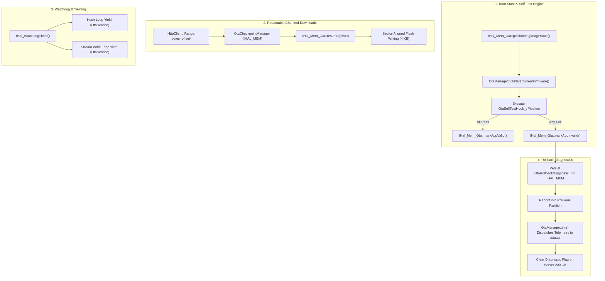

### Revised AI Implementation Prompt

```text
You are an expert Embedded Systems Reliability and Platform Software Engineer. Your objective is to implement the "Resiliency, Anti-Bricking & Self-Healing" domain (Phase 2) for the firmware update framework.

### SYSTEM CONTEXT & ARCHITECTURE
- Architecture: 3-Tier Layered Architecture (HAL -> PAL -> App -> System).
  * HAL: IHal_Mem_Ota, IHal_Mem, IHal_Watchdog (Platform/ESP32 implementations: mem_ota, mem_nvs).
  * PAL: IOtaService, IOtaTransport, IHttpClient, IOtaCheckpointManager (Platform implementations: OtaService, OtaHttpTransport, HttpsClient).
  * App: IOtaManager, OtaManager.
- Constraints: C++17/C++20 with -fno-exceptions and -fno-rtti, FreeRTOS abstraction, dual-bank A/B boot layout.
- Error Handling: Use standard sys_error_t returns, TRANSLATE_ERROR() for vendor error conversions, and multi-line macros (RETURN_IF_ERROR, RETURN_ON_ERROR) with right-aligned comments.
- Resource Safety: Enforce strict RAII, Rule of Five on all hardware/network state holders, zero dynamic memory allocations in ISRs, and std::memcpy for raw byte streams.
- Code Standards: Allman brace formatting, 4-space indentation, no 'using namespace' in headers, and comprehensive Doxygen comments.

### CORE OBJECTIVES
1. Provisional Boot Validation & Self-Healing Engine:
   - Abstract boot state confirmation behind IHal_Mem_Ota (e.g., ImageState::PendingVerify, ImageState::Valid, ImageState::Invalid).
   - Implement an extensible self-test callback pipeline in OtaManager (storage, peripherals, network link, task health).
   - Execute automatic rollback via IHal_Mem_Ota::markAppInvalid() on self-test failure, panic, or watchdog timeout.
   - Commit boot partition via IHal_Mem_Ota::markAppValid() only when all validation hooks pass.
2. Resumable Chunked Downloads (HTTP Range Requests):
   - Extend IHttpClient and IOtaTransport to support byte-range streaming ('Range: bytes=offset-').
   - Create a platform-agnostic OtaCheckpointManager backed by IHAL_MEM to track download progress (byte offset, target size, target SHA-256, version tag).
   - Ensure flash write operations on resumed sessions align with physical flash sector boundaries (4096 bytes) and avoid re-erasing or overwriting valid blocks.
   - Invalidate checkpoints if target version, image hash, or file size changes during polling cycles.
3. Watchdog & CPU Starvation Prevention:
   - Provide an abstract IHal_Watchdog / cooperative yield interface.
   - Inject cooperative RTOS yields and watchdog refresh calls inside tight execution loops (progressive hash calculation, network stream read/writes, and delta decompression).
4. Post-Rollback Diagnostics & Fleet Telemetry:
   - Persist crash/rollback diagnostic codes in dedicated non-volatile storage (IHAL_MEM) prior to triggering reboot/rollback.
   - On fallback boot into the previous partition, detect the diagnostic flag, transmit a status report to /api/v1/ota/status, and clear the flag.

### DELIVERABLES REQUIRED
- Clean, production-ready C++ header and source files for IOtaManager, OtaManager, IOtaService, OtaService, IOtaTransport, OtaHttpTransport, IHttpClient, HttpsClient, IHal_Mem_Ota, and mem_ota.
- New OtaCheckpointManager class backed by IHAL_MEM.
- Automated HIL/unit test suite simulating power cuts, corrupted chunks, dropped connections, and failed self-tests.
```

---

### Revised Checklist: Resiliency, Anti-Bricking & Self-Healing

#### 1. Provisional Boot Validation & App Self-Test Engine
- [ ] **HAL Boot Partition State Abstraction (`IHal_Mem_Ota.h` & `mem_ota.hpp`):**
  - [ ] Define platform-agnostic partition state enumeration:
    ```cpp
    enum class OtaImageState : uint8_t
    {
        Valid = 0,
        Invalid,
        PendingVerify,
        Unknown
    };
    ```
  - [ ] Add `virtual sys_error_t getRunningImageState(OtaImageState& outState) = 0;` to `IHal_Mem_Ota`.
  - [ ] Implement `mem_ota::getRunningImageState()` via `esp_ota_get_state_partition()`.
- [ ] **Extensible Application Self-Test Pipeline (`IOtaManager.hpp` & `OtaManager.hpp`):**
  - [ ] Define self-test callback signature:
    ```cpp
    using OtaSelfTestHook_t = std::function<sys_error_t()>;
    ```
  - [ ] Add `registerSelfTest(const std::string& name, OtaSelfTestHook_t testHook)` to `IOtaManager`.
  - [ ] Implement modular diagnostic hooks:
    - [ ] `checkStorageIntegrity()`: Asserts read/write operations against non-volatile memory partitions.
    - [ ] `checkPeripheralBus()`: Asserts health of attached I2C/SPI sensors and GPIO expanders.
    - [ ] `checkNetworkLink()`: Validates Wi-Fi station association and gateway ping/DNS reachability.
- [ ] **Self-Healing State Machine Execution (`OtaManager.cpp`):**
  - [ ] Implement `OtaManager::validateCurrentFirmware()`:
    - [ ] Query active image status via `_memOta.getRunningImageState()`.
    - [ ] If status is `OtaImageState::PendingVerify`:
      - [ ] Sequentially execute all registered `OtaSelfTestHook_t` routines.
      - [ ] On any hook failure: Log failure, record diagnostic code in storage, and execute `_memOta.markAppInvalid()`.
      - [ ] If all hooks succeed: Call `_memOta.markAppValid()` to clear trial state and commit the active bank.

---

#### 2. Resumable Chunked Downloads (HTTP Range Requests)
- [ ] **HTTP Interface & Client Range Request Support (`IHttpClient.hpp` & `HttpsClient.hpp`):**
  - [ ] Add `rangeStartOffset` and `rangeEndOffset` fields to `HttpClientOptions_t`.
  - [ ] In `HttpsClient`, format and append `Range: bytes=<offset>-` header when `rangeStartOffset > 0`.
  - [ ] Update response status evaluation: Accept `206 Partial Content` as a valid status alongside `200 OK`.
- [ ] **NVS Checkpoint Abstraction (`OtaCheckpointManager.hpp` & `.cpp`):**
  - [ ] Create `OtaCheckpointManager` decoupled from vendor APIs using `IHAL_MEM`:
    ```cpp
    struct OtaCheckpoint_t
    {
        char     targetVersion[32];
        char     targetHash[65];
        size_t   targetSize;
        size_t   bytesWritten;
        uint32_t crc32;
    };
    ```
  - [ ] Implement `save(const OtaCheckpoint_t& cp)` with CRC32 integrity checks.
  - [ ] Implement `load(OtaCheckpoint_t& outCp)` asserting matching version, hash, and total size against the incoming server manifest.
  - [ ] Implement `clear()` to purge checkpoint upon successful download completion or version invalidation.
- [ ] **Resumable Partition Writing (`IHal_Mem_Ota.h` & `mem_ota.cpp`):**
  - [ ] Add `resume(size_t expectedTotalSize, size_t startOffset)` to `IHal_Mem_Ota`.
  - [ ] In `mem_ota`, ensure `startOffset` is aligned to physical 4 KB sector boundaries (`0x1000`).
  - [ ] Advance `_updateHandle` write offset without erasing already written flash sectors.

---

#### 3. Watchdog & CPU Starvation Prevention
- [ ] **Hardware Watchdog Abstraction (`IHal_Watchdog.h` & Platform Adapter):**
  - [ ] Create generic interface:
    ```cpp
    class IHal_Watchdog
    {
    public:
        virtual ~IHal_Watchdog() = default;
        virtual sys_error_t registerCurrentTask() = 0;
        virtual sys_error_t feed() = 0;
        virtual sys_error_t unregisterCurrentTask() = 0;
    };
    ```
  - [ ] Implement platform driver wrapping the Task Watchdog Timer (`esp_task_wdt_*`).
- [ ] **Cooperative Yielding in Intensive Loops (`OtaService.cpp` & `mem_ota.cpp`):**
  - [ ] In `OtaService::_calculatePartitionHash`:
    - [ ] Feed watchdog on every 4 KB sector read iteration.
    - [ ] Inject `vTaskDelay(pdMS_TO_TICKS(1))` to yield execution to higher-priority communication tasks.
  - [ ] In network stream write loops and delta decompression feeds (`esp_delta_ota_feed_patch`):
    - [ ] Feed watchdog and insert cooperative yields every `CHUNK_SIZE_BYTES` block.

---

#### 4. Rollback Diagnostics & Fleet Telemetry Loop
- [ ] **Persistent Rollback Diagnostics:**
  - [ ] Define standardized rollback diagnostic data structure:
    ```cpp
    struct OtaRollbackDiagnostic_t
    {
        uint32_t failureReasonCode;
        uint32_t subErrorCode;
        char     failedVersion[32];
        uint64_t timestampUtc;
    };
    ```
  - [ ] In `OtaManager`, record diagnostic details into non-volatile storage (`IHAL_MEM`, `"fctry"` / `"sys_cfg"`) immediately before invoking `markAppInvalid()`.
- [ ] **Automated Telemetry Dispatch on Boot:**
  - [ ] In `OtaManager::init()`:
    - [ ] Check if a pending rollback diagnostic record exists in storage.
    - [ ] If found, construct and queue a failure report:
      ```json
      {
        "status": "failure",
        "error_code": 104,
        "failed_version": "1.0.1",
        "reason": "SELF_TEST_NVS_FAIL"
      }
      ```
    - [ ] Transmit payload to `POST /api/v1/ota/status` once network transport connects.
    - [ ] Purge diagnostic record from storage upon receiving HTTP 200 response from the server.

---

### Implementation Dependency Graph

